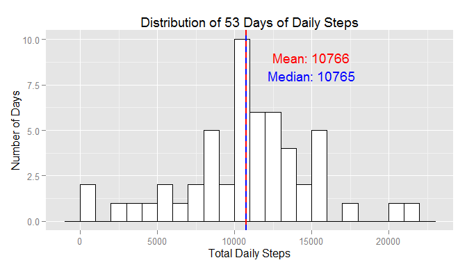
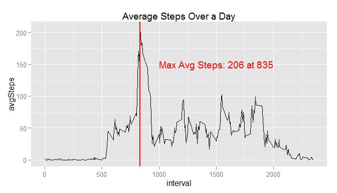
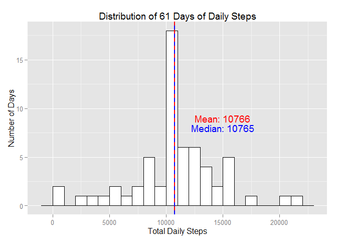
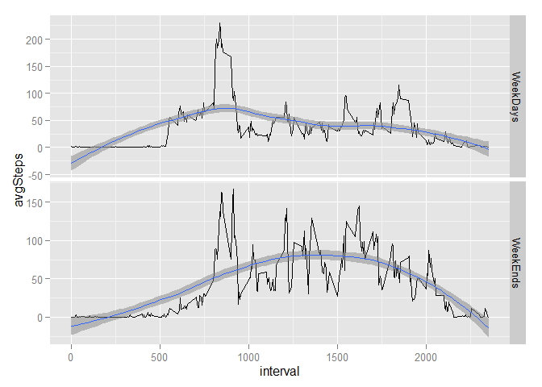

# Reproducible Research: Peer Assessment 1

## Set Options for all chunks

Set echo=TRUE globally


```r
library(knitr)
opts_chunk$set(echo = TRUE)
```

## Loading and preprocessing the data

Load project data
- unzip() and read.csv needed from utils package
- lubridate will be used for date conversion


```r
library("utils",quietly=TRUE)
library("lubridate",quietly=TRUE)
```

```
## Warning: package 'lubridate' was built under R version 3.1.3
```

```r
zipName <- "activity.zip"
PA1actData <- read.csv(unzip(zipName), header = FALSE, skip = 1, as.is=TRUE)
names(PA1actData) <- c("steps","date","interval")
PA1actData$date <- ymd(PA1actData$date)
str(PA1actData)
```

```
## 'data.frame':	17568 obs. of  3 variables:
##  $ steps   : int  NA NA NA NA NA NA NA NA NA NA ...
##  $ date    : POSIXct, format: "2012-10-01" "2012-10-01" ...
##  $ interval: int  0 5 10 15 20 25 30 35 40 45 ...
```

## What is mean total number of steps taken per day?

Make histogram of total steps taken per day
and summarize with mean and median values

- dplyr will provide data analysis support
- ggplot2 will be used for plotting


```r
library("dplyr",quietly=TRUE,warn.conflicts=FALSE)
library("ggplot2",quietly=TRUE)

## Summarize the daily total steps ignoring days with missing data
##   Days with Data
dailyDataDays <- PA1actData[complete.cases(PA1actData),]
##   Data from the Days with Data Totaled per Day
dailyData  <- dailyDataDays %>%
                group_by(date) %>% 
                summarize(totSteps=sum(steps))

## Plot distribution with mean and median lines
ddMean <- as.integer(with(dailyData,mean(totSteps, na.rm=T)))
ddMeanLab <- paste("Mean:",as.character(ddMean))
ddMedian <- as.integer(with(dailyData,median(totSteps, na.rm=T)))
ddMedianLab <- paste("Median:",as.character(ddMedian))
ddDays <- length(unique(as.character(PA1actData[complete.cases(PA1actData),]$date)))
ddDaysLab <- paste("Distribution of",as.character(ddDays),
                   "Days of Daily Steps")

## Plot the histogram with Mean and Median lines
ggp <- ggplot(dailyData, aes(x=totSteps)) +
                geom_histogram(binwidth=1000,
                               colour="black",
                               fill="white") +
                xlab("Total Daily Steps") +
                ylab("Number of Days") +
                geom_vline(aes(xintercept=ddMean),
                           color="red",
                           linetype="solid",
                           size=1,
                           show_guide=TRUE) +
                geom_vline(aes(xintercept=ddMedian),
                           color="blue",
                           linetype="dashed",
                           size=1,
                           show_guide=TRUE) +
                annotate("text",x=15000,y=9,label=ddMeanLab,
                         color="red") +
                annotate("text",x=15000,y=8,label=ddMedianLab,
                         color="blue") +
                ggtitle(ddDaysLab)

        ggsave(paste("figures/dailyData","Chunk02",".png",sep=""))
```

```
## Saving 7 x 4 in image
```

```r
        plot(ggp)
```

 

## What is the average daily activity pattern?


```r
## Analyzes steps taken over the time of day
#  Plotting done in ggplot2
library("ggplot2",quietly=TRUE)
#  Data manipulation in dplyr
library("dplyr",quietly=TRUE,warn.conflicts=FALSE)

## Plot time series of average steps taken
##  over the time of day, averaged over all days
##  and summarize with time of day for the max value

## Summarize the average steps taken by time of day
avgStepData  <- dailyDataDays %>%
                group_by(interval) %>% 
                summarize(avgSteps=mean(steps))

#  Find when we have the max average
avgMax <- with(avgStepData, max(avgSteps))
whenMax <- with(avgStepData,interval[avgSteps==avgMax])
maxStepDataLab <- paste("Max Avg Steps:",
                        as.character(as.integer(avgMax)),
                        "at",
                        as.character(whenMax))
        
## Plot average daily step data versus time of day
ggp <- ggplot(avgStepData, aes(x=interval,y=avgSteps)) +
        geom_line() +
        geom_vline(aes(xintercept=whenMax),
                   color="red",
                   linetype="solid", size=1) +
        annotate("text",x=1500,y=150,
                 label=maxStepDataLab,
                 color="red") +
        ggtitle("Average Steps Over a Day")

        ggsave(paste("figures/timeOfSteps","Chunk03",".png",sep=""))
```

```
## Saving 7 x 4 in image
```

```r
        plot(ggp)
```

 

## Inputing missing values

I chose to find all NAs in the step data and replace the missing data
with the mean for that daily interval across all the days.  This seems
to be the least distuptive of the time of day step data which reflects
actual usage of these devices.


```r
## Calculate # NAs in the steps data
#  Find NAs
stepNAs <- with(PA1actData,is.na(steps))
nas <- sum(stepNAs)
#  and as a percentage
nas100 <- as.integer(100 * nas/nrow(PA1actData))
#  and log it
print(paste(as.character(nas),
            " intervals had no data for an average of ",
            as.character(nas100),
            "% missing!",sep=""))
```

```
## [1] "2304 intervals had no data for an average of 13% missing!"
```

```r
## Build data with NAs filled in by mean of the steps in the interval

## Plot distribution with mean and median lines
ddMean <- as.integer(with(dailyData,mean(totSteps, na.rm=T)))
ddMeanLab <- paste("Mean:",as.character(ddMean))
ddMedian <- as.integer(with(dailyData,median(totSteps, na.rm=T)))
ddMedianLab <- paste("Median:",as.character(ddMedian))

PA1actDataNoNAs <- data.frame(PA1actData %>%
  group_by(interval) %>%
  mutate(steps=ifelse(is.na(steps),
                    as.integer(mean(steps, na.rm=TRUE)),
                    steps
                    )
         )
  )
ddDays <- length(unique(as.character(PA1actDataNoNAs[complete.cases(PA1actDataNoNAs),]$date)))

str(PA1actDataNoNAs)
```

```
## 'data.frame':	17568 obs. of  3 variables:
##  $ steps   : int  1 0 0 0 0 2 0 0 0 1 ...
##  $ date    : POSIXct, format: "2012-10-01" "2012-10-01" ...
##  $ interval: int  0 5 10 15 20 25 30 35 40 45 ...
```

```r
dailyData  <- data.frame(PA1actDataNoNAs %>%
                group_by(date) %>% 
                summarize(totSteps=sum(steps))
                )
ddDaysLab <- paste("Distribution of",as.character(ddDays),
                   "Days of Daily Steps")

## Plot the histogram with Mean and Median lines
ggp <- ggplot(dailyData, aes(x=totSteps)) +
                geom_histogram(binwidth=1000,
                               colour="black",
                               fill="white") +
                xlab("Total Daily Steps") +
                ylab("Number of Days") +
                geom_vline(aes(xintercept=ddMean),
                           color="red",
                           linetype="solid",
                           size=1,
                           show_guide=TRUE) +
                geom_vline(aes(xintercept=ddMedian),
                           color="blue",
                           linetype="dashed",
                           size=1,
                           show_guide=TRUE) +
                annotate("text",x=15000,y=9,label=ddMeanLab,
                         color="red") +
                annotate("text",x=15000,y=8,label=ddMedianLab,
                         color="blue") +
                ggtitle(ddDaysLab)

        ggsave(paste("figures/dailyData","Chunk04",".png",sep=""))
```

```
## Saving 7 x 5 in image
```

```r
        plot(ggp)
```

 

The result of this choice was to add "average distribution days" for the
days with the missing data.  As a result we just have extra days with
the precise mean steps only and the mean and median of the data set did
not change much.

## Are there differences in activity patterns between weekdays and weekends?


```r
#  Add dayType column default to weekday
PA1actDataNoNAs <- mutate(PA1actDataNoNAs, dayType = "weekday")
#  Update Sat and Sun to weekend
PA1actDataNoNAs[wday(PA1actDataNoNAs$date, label = TRUE, abbr = TRUE) == "Sat", 4]  <- "weekend"
PA1actDataNoNAs[wday(PA1actDataNoNAs$date, label = TRUE, abbr = TRUE) == "Sun", 4]  <- "weekend"

## Analyzes steps taken over the time of day
#  Plotting done in ggplot2
library("ggplot2",quietly=TRUE)
#  Data manipulation in dplyr
library("dplyr",quietly=TRUE,warn.conflicts=FALSE)

## Plot time series of average steps taken
##  over the time of day, averaged over all days
##  and summarize with time of day for the max value

## Summarize the average steps taken by time of day for weekdays and weekends
avgStepData  <- PA1actDataNoNAs %>%
                group_by(dayType,interval) %>% 
                summarize(avgSteps=mean(steps))

#  Find when we have the max average
avgMax <- with(avgStepData, max(avgSteps))
whenMax <- with(avgStepData,interval[avgSteps==avgMax])
maxStepDataLab <- paste("Max Avg Steps:",
                        as.character(as.integer(avgMax)),
                        "at",
                        as.character(whenMax))
        
## Plot average daily step data versus time of day for weekdays and weekends
library(ggplot2)
x <- subset(avgStepData,
            dayType == "weekday",
            select = c("interval")
            )

d1 <- data.frame(x=x,
                 y=subset(avgStepData,
                          dayType == "weekday",
                          select = c("avgSteps")
                 )
)
d1$panel <- "WeekDays"
totalStepsWeekday <- as.integer(sum(d1$avgSteps))

d2 <- data.frame(x=x,
                 y=subset(avgStepData,
                          dayType == "weekend",
                          select = c("avgSteps")
                 )
)
d2$panel <- "WeekEnds"
totalStepsWeekend <- as.integer(sum(d2$avgSteps))

print(paste("The Average Total Steps per Weekday are: ",
            as.character(totalStepsWeekday),
            " versus the Average Total Steps per weekend day: ",
            as.character(totalStepsWeekend),
            ".",sep=""))
```

```
## [1] "The Average Total Steps per Weekday are: 10239 versus the Average Total Steps per weekend day: 12185."
```

```r
print(paste("The weekend Average Total Steps were ",
            as.character(
                    as.integer(100 * (totalStepsWeekend/totalStepsWeekday - 1)
                               )
                    ),
            "% more than the weekday Average Total Steps.",
            sep=""))
```

```
## [1] "The weekend Average Total Steps were 19% more than the weekday Average Total Steps."
```

```r
d <- rbind(d1, d2)

ggp <- ggplot(data = d, mapping = aes(x=interval,y=avgSteps)) +
  facet_grid(panel~., scale="free") +
  layer(data=d1, geom = c("line"), stat = "identity") +
  stat_smooth() +
  layer(data=d2, geom = c("line"), stat = "identity") +
  stat_smooth()

  ggsave(paste("figures/weekEndDayData","Chunk05",".png",sep=""))
```

```
## Saving 7 x 5 in image
## geom_smooth: method="auto" and size of largest group is <1000, so using loess. Use 'method = x' to change the smoothing method.
## geom_smooth: method="auto" and size of largest group is <1000, so using loess. Use 'method = x' to change the smoothing method.
## geom_smooth: method="auto" and size of largest group is <1000, so using loess. Use 'method = x' to change the smoothing method.
## geom_smooth: method="auto" and size of largest group is <1000, so using loess. Use 'method = x' to change the smoothing method.
```

```r
plot(ggp)
```

```
## geom_smooth: method="auto" and size of largest group is <1000, so using loess. Use 'method = x' to change the smoothing method.
## geom_smooth: method="auto" and size of largest group is <1000, so using loess. Use 'method = x' to change the smoothing method.
## geom_smooth: method="auto" and size of largest group is <1000, so using loess. Use 'method = x' to change the smoothing method.
## geom_smooth: method="auto" and size of largest group is <1000, so using loess. Use 'method = x' to change the smoothing method.
```

 

There was significant differences between weekend days and the weekdays.  Not only were there almost 20% more steps taken on average on the weekend days, but people got up later and had more steps during the midday and then went to bed later in the evening over the weekend.

A better choice for filling in the missing data (the NAs) would have been to use interval average steps from either weekdays or weekend days as appropriate.
